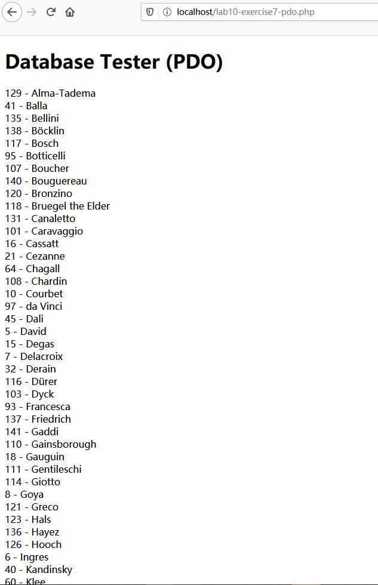
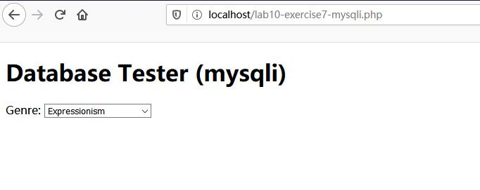
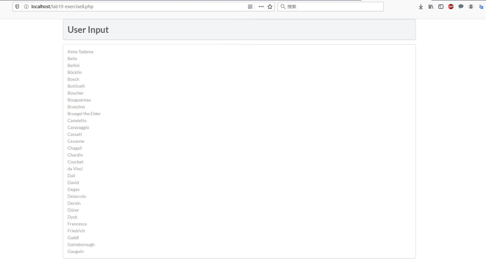
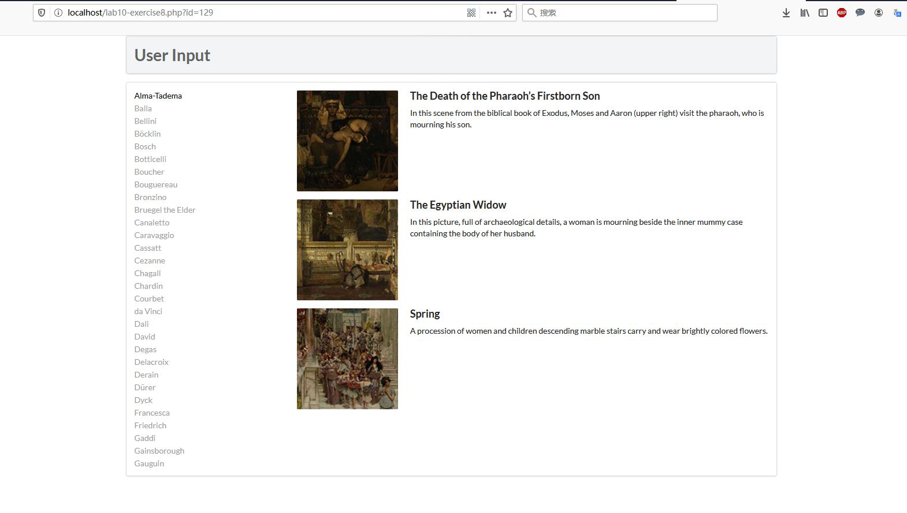
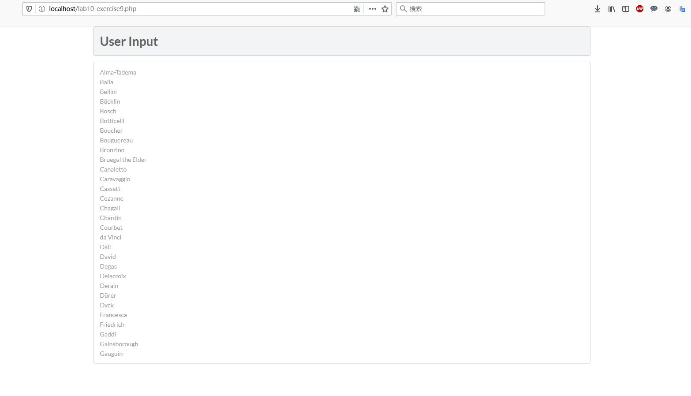
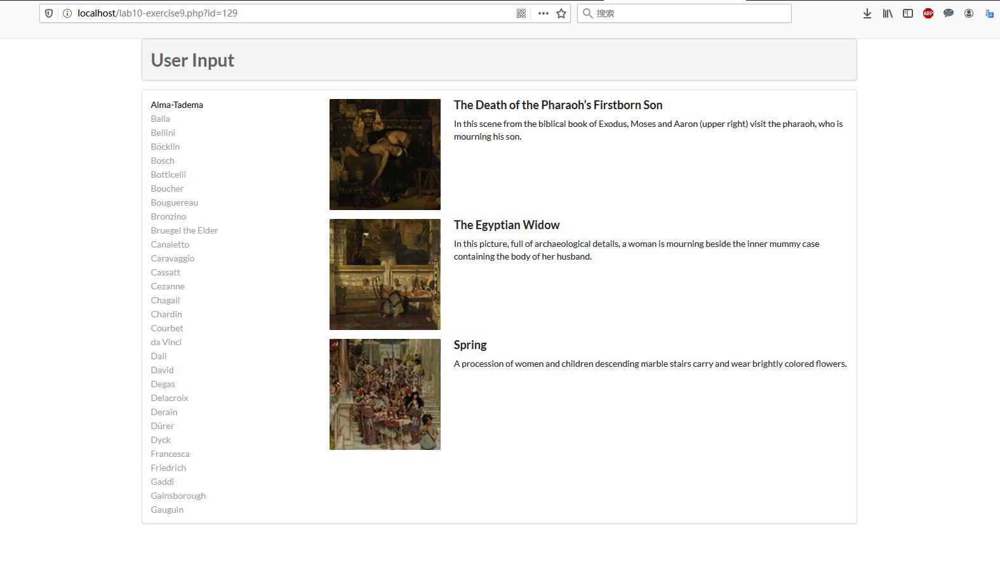

# Lab10设计文档

## 第七题

### 两种方式的截图

### 两种方式的代码解释

第一种：使用数据对象 PDO 扩展作为 PHP 访问数据库的轻量级接口，这是一个数据访问抽象层。然后用 PHP 包裹 SQL 语句去完成查询。

第二种：使用 mysqli_connect 直接连接数据库，再查找结果，查找完毕以后释放，最后切断连接。

## 第八题

### 截图

### 三个函数代码解释

function outputArtists()：根据画家的姓氏顺序查找所有的画家；然后注意 $_SERVER['SCRIPT_NAME'] 的意思是包含当前脚本的路径，因此构成一个查询链接的前提，从而用 PHP 的方式注入 html 语句；最后判断是否查询到了这个，借助 $_GET 来收集表单值。

function outputSinglePainting($row)： $row 变量是查询到的一行，选取指定的文件名，然后展示相应的图片就可以。

function outputPaintings()：根据画家的 ID 来查找指定的所有作品，并逐个调用上述函数进行展示。

## 第九题

### 截图

### 问题

Q1，执行 sql 的方式：根据我之前修数据库设计这门课以及实习洗数据的经验，大概可以分为两大类。一个是在 sql 的环境下直接输入 sql 语句，另一个是使用其他语言跟数据库相关的代码 API 包裹着 sql 语句。前者相对容易理解，后者比如我们这个 Lab 的 PHP 的 pdo 和 mysqli，再或者比如 JDBC 等等。

百度后的答案：一种是在终端交互方式下使用，称为交互式SQL；另一种是嵌入在高级语言的程序中使用，称为嵌入式SQL，而这些高级语言可以是C、PASCAL、COBOL等，称为宿主语言。 

Q2，预处理 sql 的优势：预处理 sql 的意思是，将 sql 语句里的部分值用占位符替代，使得它成为一个可以添加、修改参数的类似于函数的工具，好处有两个。一个是在写的时候，可以减少代码重复，提高代码可读性，也减少浪费；另一个就是运行的时候只需要编译一次，而可以运行多次，优化过程。但这么做的前提就是要有多次的使用，而且每次的参数都有所不同才行，否则无法提现。

